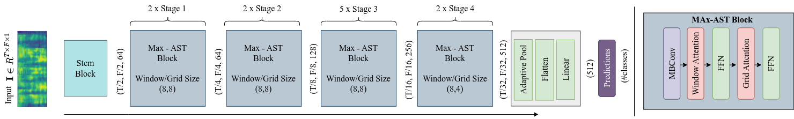

# MaxAST


## Introduction  

<p align="center"></p>

Pytorch Implementation of **Max-AST: Combining Convolution, Local and Global Self-Attentions for Audio Event Classification**

### Setting Up  
 Clone or download this repository and set it as the working directory, create a virtual environment and install the dependencies.

```
cd MaxAST/ 
conda env create -f ast.yml
conda activate ast
```

#### Data Preparation Audioset  
Since the AudioSet data is downloaded from YouTube directly, videos get deleted and the available dataset decreases in size over time. So you need to prepare the following files for the AudioSet copy available to you.

Prepare data files as mentioned in [AST](https://github.com/YuanGongND/ast.git)

#### Validation 
We have provided the best model. Please download the [model weight](https://drive.google.com/file/d/10qB6ByUooMLMGUv2B2nWEstpEs3fgTii/view?usp=sharing) and keep it in `pretrained_models/audioset_fullset/`. 

You can validate the model performance on your AudioSet evaluation data as follows,
```
cd MaxAST/egs/audioset
bash eval_run.sh
```
This script create log file with date time stamp in the same directory. You can find the mAP in the end of the log file.


## Citing  
We are using the [AST](https://github.com/YuanGongND/ast) repo for model training and [timm](https://github.com/huggingface/pytorch-image-models/tree/main/timm)(do not install timm) for model implementation and ImageNet-1K pretrained weights.
```  
@inproceedings{gong21b_interspeech,
  author={Yuan Gong and Yu-An Chung and James Glass},
  title={{AST: Audio Spectrogram Transformer}},
  year=2021,
  booktitle={Proc. Interspeech 2021},
  pages={571--575},
  doi={10.21437/Interspeech.2021-698}
}
```  
```  
@misc{rw2019timm,
  author = {Ross Wightman},
  title = {PyTorch Image Models},
  year = {2019},
  publisher = {GitHub},
  journal = {GitHub repository},
  doi = {10.5281/zenodo.4414861},
  howpublished = {\url{https://github.com/rwightman/pytorch-image-models}}
}
```  
  

